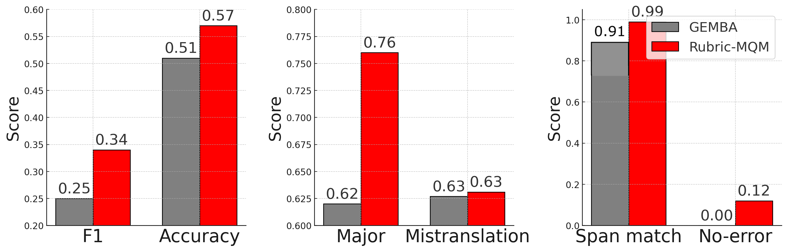
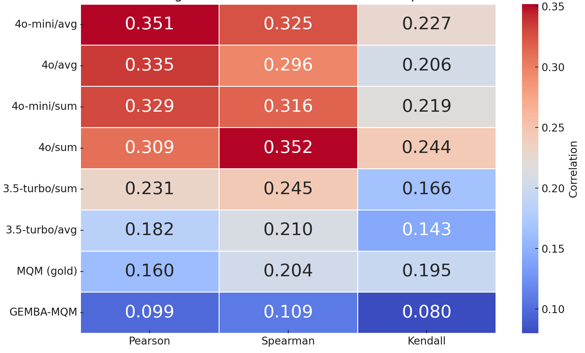
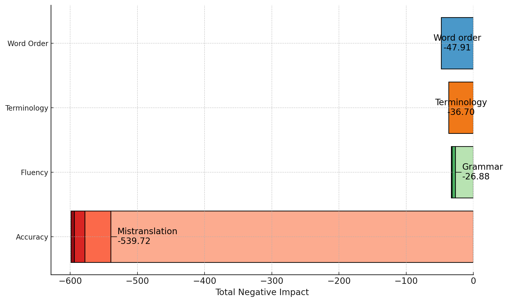

# RUBRIC-MQM

**LLM-as-Judge for Span-Level Machine Translation Evaluation**

---

## ⚡ Summary

**RUBRIC-MQM** is a modular, span-level MT evaluation framework that uses **LLMs to detect MQM-style translation errors** and compute **rubric-based scores (0–100)** at the span level. It improves upon [GEMBA-MQM (Kocmi & Federmann, 2023)](https://github.com/MicrosoftTranslator/GEMBA) by addressing newly discovered issues such as:

- Overuse of _MISTRANSLATION_ and _MAJOR_ labels  
- Systematic failure of _NO-ERROR_ cases  
- Spurious category generation

<figure>
    
    <figcaption>Figure 1: Six advantages of Rubric-MQM, addressing existing challenges of GEMBA-MQM. 'Major' and Mistranslation indicate precision, while 'No-error' refers to recall score.
</figure>

Furthermore, when assessing reference translations, RubricMQM demonstrates a markedly enhanced correlation, highlighting its robustness when applied to high-performing models. The accompanying figure also presents a novel evaluation insight, indicating that RubricMQM is capable of providing a new system-level result (in this case, for _Reference A_).

<p float="center">
  
  
</p>
Figure 2: Segment-level correlations to DA-SQM.

Figure 3. System-level score of _Reference A_ (-716.54).

---

## 🧩 Core Capabilities

- **Span-level labeling** — Error classification with span localization  
- **Rubric scoring** — Numerical quality estimation (1–100) based on prompt-based scoring criteria  
- **Reference-optional** — Works with or without gold references  
- **Multilingual & few-shot friendly** — Adaptable prompts for non-English use cases  
- **Batch processing** — Scales across datasets via CLI or pipeline  
- **Easy application of PromptCUE** — Our meta-evaluation strategy that frames evaluation as a classification task, enabling error profiling without error detection heuristics.

---

## 📦 Installation

```bash
git clone https://github.com/your-org/rubric-mqm
cd rubric-mqm
pip install -r requirements.txt
```

---

## 🚀 Quickstart

### 🛠️ 1. Build prompt from segments

```python
from evaluator.prompt import RubricMQMPrompt

prompt = RubricMQMPrompt(
    source_lang="English",
    target_lang="Spanish",
    source_seg="This is a test.",
    target_seg="Es una prueba.",
)
print(prompt.create_prompt())
```

---

### 🧪 2. Run CLI evaluation

```bash
python3 -m evaluator.worker \
            -d data/sample.csv \
            -o data/out.csv \
            -e data/error.jsonl \
            -m "gpt-4.1" \
            -p  # Enable PromptCUE mode
```

---

## 🗂 Directory Structure

```
rubric-mqm/
├── evaluator/
│   ├── worker.py              # CLI entrypoint for evaluation
│   ├── prompt/                # Prompt logic and rubric templates
│   ├── slot_scenarios/        # Prebuilt prompt contexts for a better option
├── parser/                    # Output parsing utilities
├── data/                      # Input/output examples
├── requirements.txt
└── README.md
```

---

## 🔖 Citation
This paper has been accepted to the ACL 2025 Industry Track. Until the official ACL citation is available, please use the following citation for the preprint version.

```bibtex
@article{kim2025dr100,
  author       = {Ahrii Kim},
  title        = {{DR-100: Rubric-Based LLM-as-Judge in Machine Translation Via a Simple Meta-Evaluation Framework}},
  journal      = {TechRxiv},
  year         = {2025},
  month        = {April},
  day          = {28},
  doi          = {10.36227/techrxiv.174584742.28568002/v1},
  url          = {https://doi.org/10.36227/techrxiv.174584742.28568002/v1},
  note         = {Preprint}
}
```

---

## 📄 License

MIT License (see [`LICENSE`](LICENSE))
